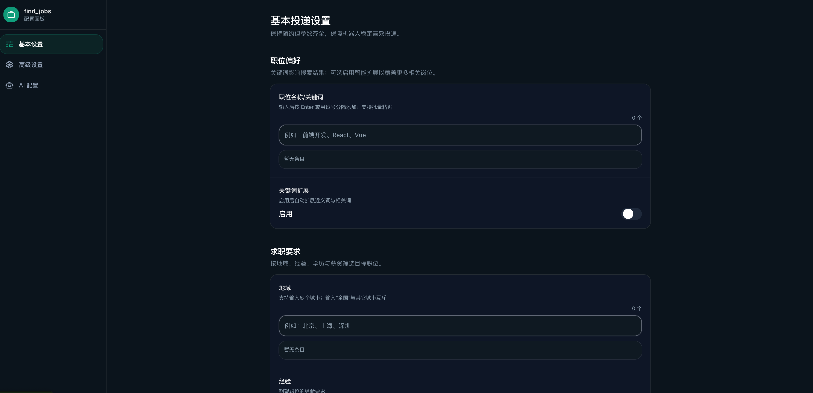

# find_jobs

基于 Go + Playwright 的 BOSS 直聘自动投递工具，附带 React 管理页面，可一站式配置关键词、地域、AI 招呼与企业微信通知。目标是“拉代码 → 配配置 → 直接跑”。

## 核心特性
- **自动化投递**：按“关键词 × 城市”组合循环搜索，遵循 `boss.max`（每日次数）与 `boss.interval`（休眠小时数），并智能过滤不活跃 HR 与黑名单。
- **稳定登录**：默认后台静默读取 `data/boss/browser_cookie.txt` 或 `data/boss/cookie.json`；提前导出 Cookie 放入对应文件即可，无需再次扫码。
- **可视化管理**：前端页面仅展示后端真实配置；任意改动都会在 ~0.8s 内自动保存到 `config.yaml`，刷新不会丢失。
- **AI + 通知**：支持自定义 AI Prompt 生成招呼语，并通过企业微信机器人（Webhook）推送 Markdown 模板消息。
- **本地优先**：所有字体/图标资源本地化，build 后的 `front/dist` 可直接由后端或任意静态服务器托管。

## 运行流程（Overview）
1. **启动**：`go run .` 或 Docker 脚本会监听 `:38888`，同时暴露静态页面与 `/api/config`。
2. **读取配置**：前端拉取 `config.yaml` → 转换为表单数据，仅展示不落盘。
3. **用户修改**：每次更新会触发 debounce 保存，后端负责合并写盘并加锁，防止竞态。
4. **登录校验**：Playwright 首先尝试 `browser_cookie.txt`，其次 `cookie.json`；二者皆空会直接报错提醒补充 Cookie。
5. **投递循环**：关键词 & 城市组合搜索 → 过滤黑名单/不活跃 HR → （可选）AI 生成问候 → 发起沟通 → 写入统计 & 推送 → 达到上限后休眠。

## 前端页面一览
- **布局**：左侧固定导航，右侧主内容在 ≥xl 屏宽时占可用宽度的 2/3，并提供深/浅色切换按钮。
- **模块**：
  - *基本设置*：关键词、地域（Chip 输入）、期望薪资、学历/经验等。
  - *高级设置*：间隔、等待时间、最大投递次数、过滤策略等。
  - *AI / 通知*：AI 自我介绍、Prompt、企业微信机器人模板（附占位符说明）。
  - *登录凭证*：上传/校验 Cookie/Text 凭证，查看当前状态。
- **交互细节**：统一的圆角 + 描边 + 焦点态；Chip 输入支持 Enter/逗号添加、Backspace 删除；所有开关均带 ARIA，可键盘控制。

## 快速上手
1. **安装依赖**：Go ≥ 1.25、Node ≥ 20、Playwright 浏览器（`go run github.com/playwright-community/playwright-go/cmd/playwright@v0.5200.1 install chromium`）。
2. **构建前端**：`(cd front && npm ci && npm run build)`，产物在 `front/dist`。
3. **准备 Cookie**：在本地浏览器登陆 BOSS，导出 Cookie 到 `data/boss/browser_cookie.txt` 或 `data/boss/cookie.json`。
4. **启动**：`go run .`（或执行 `scripts/start.sh` 使用 Docker）。首次访问 `http://localhost:38888` 即可进入管理界面。

更多部署形态（Docker、源码调试、服务器脚本）请查看 [deploy.md](deploy.md)。

## 目录速查
- `main.go`：入口，加载配置与 .env，启动 API + 投递循环。
- `internal/api/`：`/api/config` 路由与静态资源托管。
- `internal/boss/`：搜索、筛选、沟通、计数、推送等核心逻辑。
- `internal/config/`：YAML 解析、城市/学历等枚举映射、默认值填充。
- `internal/ai/`：兼容 OpenAI 的调用封装，读取 `.env` 中的 KEY/MODEL。
- `internal/bot/`：企业微信机器人客户端（Webhook + Markdown 模板渲染）。
- `internal/play/`：Playwright 初始化、反检测脚本与浏览器缓存清理。
- `front/`：Vite + React 管理界面，`npm run dev` 端口 3000；生产构建产物由后端静态托管。
- `scripts/`：`start.sh`（本地构建 + Docker 运行）、`start-server.sh`（服务器拉取镜像再运行）。
- `data/`：运行期数据（Cookie、黑名单、统计等）。

## 配置文件
- `config.yaml`：关键词、城市、筛选条件、AI/通知开关等业务参数。
- `.env`：敏感信息（如 `HOOK_URL`、`API_KEY`、`MODEL`、`BASE_URL` 等）。
- `data/boss/cookie.json` / `data/boss/browser_cookie.txt`：登录凭据，二选一即可。

若需排查部署与常见问题，请参阅 [deploy.md](deploy.md)。

## 许可证（LICENSE）

本项目基于 [Apache License 2.0](LICENSE) 授权：

- 可在保留版权与许可证文本的前提下自由使用、复制、修改与再发行（含商业场景）。
- 对外分发的修改版需声明改动，并继续附带许可证文本及 NOTICE（若存在）。
- 项目以“按原样”提供，不附带任何明示或暗示的担保；若自行提供额外担保/支持，需同时使其他贡献者免责。
